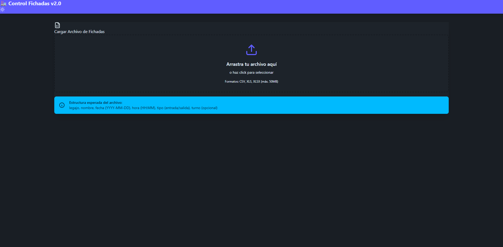

  # ⏱️ Control de Fichadas Inteligente

  

    <b>Plataforma web de alto rendimiento para la gestión, análisis y auditoría automatizada de asistencia del personal.</b>
  

  
  
  
  
  

---

## 📌 Vista Previa del Sistema

---

## ✨ Características Principales

### 📊 **Dashboard Executive & Métricas en Tiempo Real**
- Resumen inmediato de indicadores clave: **Total de Empleados**, **Personal Presente**, **Tardanzas**, **Ausentes** y **Cómputo Total de Horas Trabajadas**.
- Visualización limpia para la toma rápida de decisiones por parte de supervisores y Recursos Humanos.

### ⚡ **Procesamiento Inteligente de Fichadas**
- Carga ágil de archivos en formatos **CSV** y **Excel (.xlsx)**.
- Algoritmo de emparejamiento automático para fichadas de **Turno Mañana** y **Turno Tarde**.
- Cálculo preciso de horas trabajadas según las normas operativas.

### 🎯 **Detección de Novedades y Auditoría**
- Clasificación automática de registros:
  - ✅ **Normal**: Fichadas en regla y horario establecido.
  - ⏱️ **Tardanza**: Marcaciones fuera del margen de tolerancia.
  - 🚫 **Ausente**: Ausencias detectadas en la jornada.
  - 🩺 **Enfermedad / Justificados**: Registro de novedades de salud.

### 🔍 **Filtros Avanzados de Búsqueda**
- Búsqueda en tiempo real por **Nombre** o **Legajo** de empleado.
- Filtrado flexible por **Rango de Fechas** (Fecha Inicio / Fecha Fin).
- Segmentación instantánea según el tipo de novedad.

### ⚙️ **Configuración Personalizada de Turnos**
- Gestión dinámica de rangos horarios de entrada y salida.
- Definición de tolerancia de minutos para el cómputo de llegadas tarde.
- Persistencia local de configuraciones personalizadas.

### 📥 **Exportación Multi-Formato**
- Exportación de reportes procesados a formatos **Excel (.xlsx)**, **CSV** y **PDF**, listos para liquidación de haberes y auditorías.

---

## 🚀 Tecnologías Principales

| Tecnología | Descripción |
| :--- | :--- |
| **React 18** | Arquitectura basada en componentes reactivos y eficientes. |
| **TypeScript** | Tipado estático robusto para garantizar la integridad de los datos de fichadas. |
| **Vite** | Empaquetador ultra rápido para desarrollo y compilación de producción. |
| **Tailwind CSS & DaisyUI** | Sistema de diseño moderno, limpio y responsive. |
| **Lucide React & Hot Toast** | Iconografía elegante y sistema de notificaciones en tiempo real. |
| **SheetJS (XLSX) & Date-fns** | Procesamiento de archivos de cálculo y manipulaciones de fecha/hora de alta precisión. |

---

## 💎 Aspectos Destacados

- 🔒 **Privacidad Total**: El procesamiento se realiza 100% en el cliente en el navegador; los archivos sensibles de fichadas no se envían a servidores externos.
- 🎨 **Experiencia de Usuario Premium**: Interfaz moderna, clara y optimizada para operar de manera intuitiva desde cualquier pantalla.
