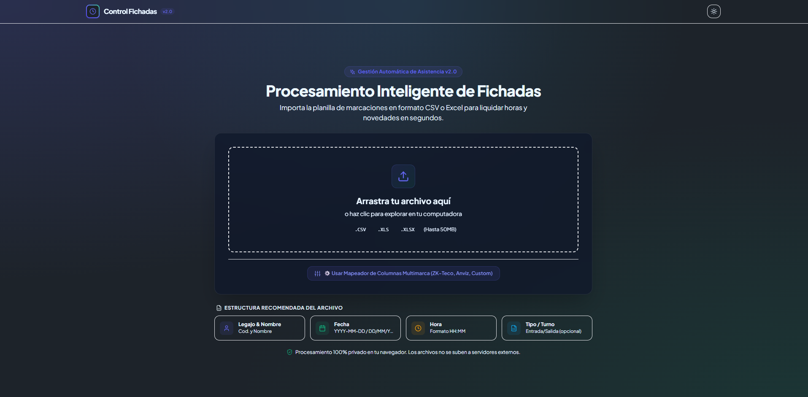
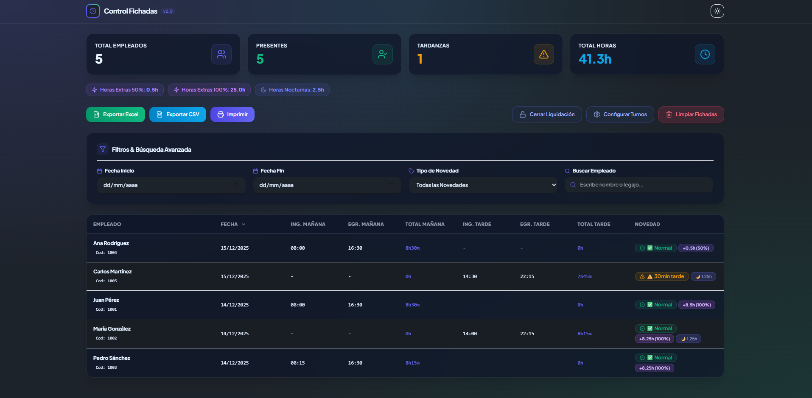
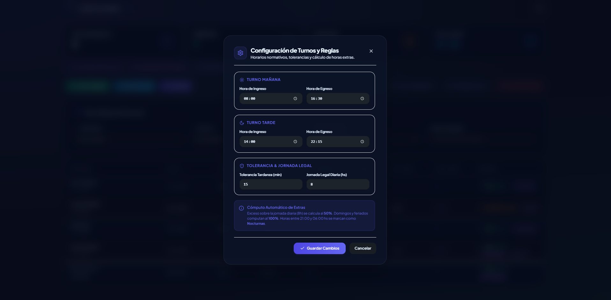
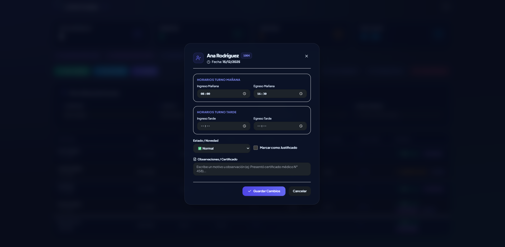

  # ⏱️ Control de Fichadas Inteligente v2.0

  

    <b>Plataforma web de alto rendimiento para la gestión, análisis, auditoría y liquidación automatizada de asistencia de personal.</b>
  

  
  
  
  
  

---

## 📸 Galería de Capturas del Sistema

  
  

  
  

---

## ✨ Características Principales

### 📊 **Dashboard Executive & Métricas en Tiempo Real**
- Indicadores clave inmediatos: **Total de Empleados**, **Personal Presente**, **Tardanzas**, **Ausentes**, **Horas Totales Trabajadas**, **Horas Extras (50% y 100%)** y **Horas Nocturnas**.
- Paneles visuales intuitivos para la toma rápida de decisiones por parte de supervisores y Recursos Humanos.

### ⚡ **Procesamiento Inteligente & Mapeador Multimarca**
- Carga ágil de planillas en formatos **CSV**, **XLS** y **XLSX**.
- **Asistente Mapeador de Columnas**: Importación compatible con cualquier reloj biométrico (**ZK-Teco**, **Hikvision**, **Anviz**, **Dahua** y planillas personalizadas).
- Algoritmo de emparejamiento automático para fichadas de **Turno Mañana** y **Turno Tarde**.

### ✍️ **Edición Manual Auditada y Justificativos**
- Edición rápida de marcas de ingreso/egreso al hacer clic en cualquier fila.
- Carga de licencias y justificativos: **Vacaciones**, **Licencia Médica**, **Atraso Justificado**, **Ausente**, etc.
- Campo de observaciones libres (ej: *"Presentó certificado médico N° 458"*).
- Alerta automática para **Fichadas Incompletas**.

### 🌙 **Motor Avanzado de Horas Extras y Nocturnidad**
- **Horas Extras al 50%**: Cómputo automático del exceso sobre la jornada diaria en días hábiles.
- **Horas Extras al 100%**: Cómputo automático en **Domingos** y **Feriados**.
- **Horas Nocturnas**: Recargo de horas laboradas entre las 21:00 hs y las 06:00 hs.
- Tolerancia de tardanzas y horas de jornada diaria totalmente configurables.

### 🔒 **Persistencia Local y Cierres de Liquidación**
- **Persistencia en Navegador (IndexedDB)**: Guardado automático de datos cargados y editados sin pérdida al recargar.
- **Cierre / Congelamiento de Liquidación**: Bloqueo de período para prevenir modificaciones accidentales una vez cerrado el mes.

### 📄 **Ficha Individual del Empleado y Exportación**
- **Ficha Individual con Firmas**: Planilla de conformidad por legajo lista para imprimir/PDF con espacio para firma del empleado y RRHH.
- Exportación completa de reportes a **Excel (.xlsx)** y **CSV** con desglose de horas extras, nocturnas y observaciones.

---

## 🚀 Tecnologías Principales

| Tecnología | Descripción |
| :--- | :--- |
| **React 18** | Arquitectura basada en componentes reactivos de alto rendimiento. |
| **TypeScript** | Tipado estático estricto para garantizar integridad en cálculos de asistencia. |
| **IndexedDB API** | Base de datos local nativa en cliente para almacenamiento privado y veloz. |
| **Vite** | Empaquetador ultra rápido para desarrollo y compilación de producción. |
| **Tailwind CSS & DaisyUI** | Sistema de diseño moderno, responsive con soporte Dark/Light Mode. |
| **Lucide React & Hot Toast** | Iconografía minimalista y sistema dinámico de notificaciones. |
| **SheetJS (XLSX) & Date-fns** | Procesamiento de archivos de hoja de cálculo y cálculo cronológico de precisión. |

---

## 💎 Aspectos Destacados

- 🔒 **100% Privado y Seguro**: Todo el procesamiento se realiza en el navegador de tu computadora. Los archivos con información sensible no se suben a servidores externos.
- 🎨 **Experiencia de Usuario Premium**: Interfaz moderna, rápida y optimizada para operar de manera fluida desde cualquier navegador.
